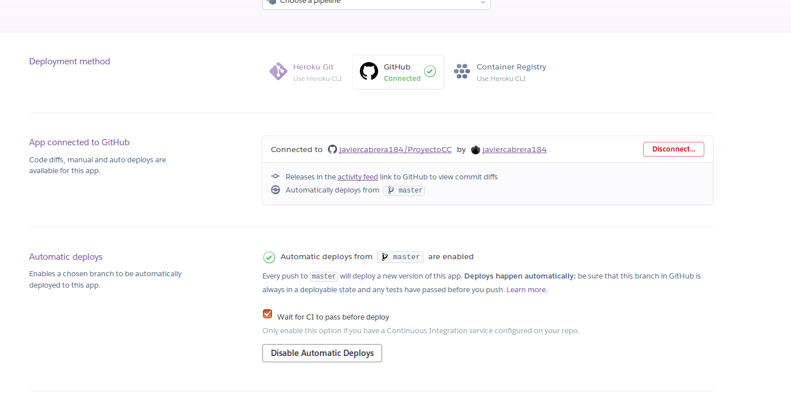

# Documentacion del Hito 2

En este hito se ha desarrollado una API REST en NodeJS usando Express, esta API se sostiene sobre una estructura de datos en la que se almacenan los datos que llegan a traves de la API.

Ahora mismo los datos son almacenados en esta estructura y gestionados por ella misma, en un futuro esto se cambiará por una base de datos no relacional.

## Estructura de datos

Esta estructura cuenta con un objeto "data" donde en sus campos se almacenan los datos que llegan sobre el estado del atleta. Los campos son:

* HeartRate: frecuencia cardiaca medida en un intervalo de tiempo.

* Peak: pico alcanzado por la frecuencia cardiaca en un intervalo de tiempo.

* Time: marca de tiempo cuando llega el dato. Sirve como indice y los datos se ordenaran a traves de este valor.

* Latitude: Latitud de la posicion almacenada.

* Longitude: Longitud de la posicion almacenada.

* Username: nombre del usuario que envia los datos.

Esta estructura de datos cuanta con todos sus getter y setter.

Ademas se añade un vector donde se almacenan objetos de tipo data. Con una variable "size" que nos da el tamaño del vector.

Sobre este vector metemos tres funciones:

* storageData: se encarga de meter un dato de posicion en el vector.

* editData: edita un valor ya almacenado en el vector.

* deleteData: borra un elemento del vector.

## API REST

Nuestra API REST cuenta con los siguientes metodos:

* GET sobre "/": Nos devuelve el estado del servicio.

* GET sobre "/data": Nos devuelve todos los datos almacenados en el vector.

* POST sobre "/data": Añade un nuevo elemento en el vector con los datos que se le pasan.

* PUT sobre "/data": Edita un elemento almacenado en el vector, se le pasa la posicion del vector que se quiere modificar y los elementos nuevos.

* DELETE sobre "/data": Elmina un elemento del vector, se le pasa el indice de este.

Esta API en un futuro se usara desde una pagina web y desde una aplicación movil.

## PaaS Heroku

Se ha seleccionado este PaaS por su simplicidad de uso, es gratuito y facil de configurar, tambien es facil de integrar con Travis, en un futuro se usará Azure.

Para instalar Heroku en local debemos de primero registrarnos en la pagina web y ejecutar estos pasos:

```sudo add-apt-repository "deb https://cli-assets.heroku.com/branches/stable/apt ./"```

``` curl -L https://cli-assets.heroku.com/apt/release.key | sudo apt-key add - ```

``` sudo apt-get update ```

``` sudo apt-get install heroku ```

Nos registramos con heroku login.

Comprobamos que tenemos NodeJS, Git y npm instalados.

Creamos la aplicacion con:

``` heroku create ```

y volvemos a introducir los credenciales

Ahora desplegamos el código:

``` git push heroku master ```

Ahora nos tenemos que asegurar que al menos una instancia de la aplicación se esta ejecutando:

``` heroku ps:scale web=1 ```

Abrimos la aplicación con:

``` heroku open ```

## Test

Los test se han realizado usando el framework "supertest" y ejecutado con mocha. Estos test se dividen en dos partes:

* Una parte comprueba la API REST que devuelva la salida correcta.

* Otra parte comprueba que las funciones que operan sobre la estructura de datos cada vez que se produzcan la salida sea coherente. Es decir, cuando se hace una insercion, borrado o actualizacion la estructura de datos sea coherente.

## Integracion con Travis

despliegue https://evening-anchorage-70354.herokuapp.com

Nos registramos con nuestra cuenta de github en Travis. Sincronizamos con nuestro reporitorio.

En heroku ponemos que el metodo de despligue sea con gihub y enlazamos con nuestro repositorio.




Instalamos travis con:

``` gem install travis ```

y configuramos travis con el comando:

``` travis setup heroku ```

Una vez hecho esto configuramos el archivo .travis.yml y hacemos un push a nuestro repositorio de github.

Ejecutamos heroku open y saldria nuestra aplicación.

Cada vez que hagamos un push a nuestro repositorio, travis ejecutará un proceso de integracion de la aplicación.

Además necesitaremos añadir un archivo Procfile, en el cual se especifican los comandos que tiene que ejecutar Heroku para el correspondiente despligue de la aplicación. La estructura de este archivo es process type: command. Con el proceso web le indicamos que recive trafico HTTP.
