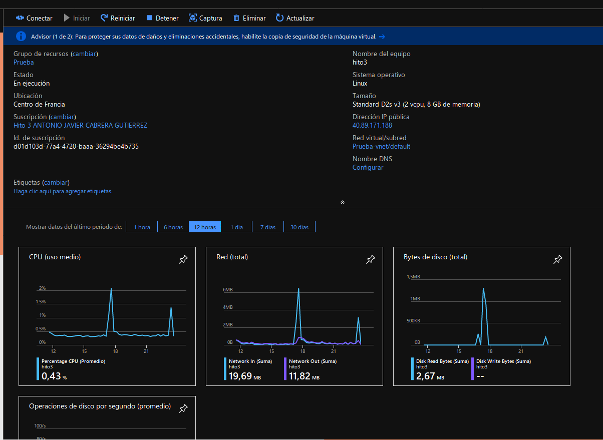
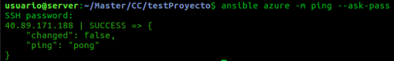
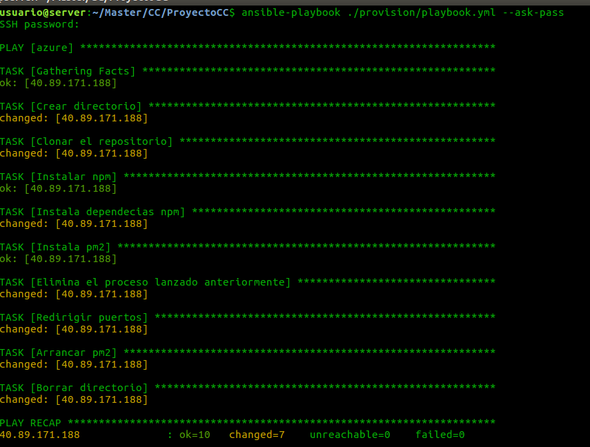
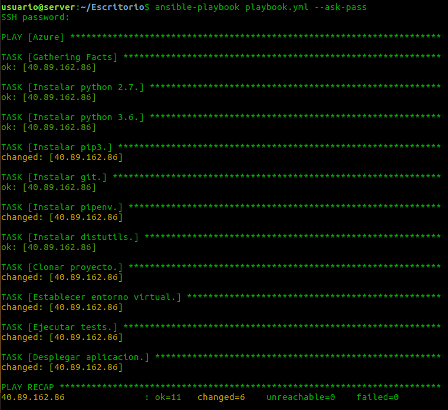
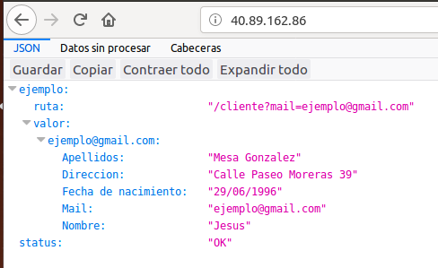

# Documentacion del Hito 3

En este hito se ha desarrollado un script de provisionamiento en Ansible sobre una máquina virtual desplegada en Azure. Tambien se ha añadido un pequeño servicio de logs a nuestra aplicación.

### Maquina Virtual

La maquina virtual usada en Azure tiene la siguiente configuración:

* S0: Ubuntu Server 18.04
* Region: Francia.
* Autenticación: contraseña.
* Usuario: antonio
* Direccion Ip: estática
* Puertos abiertos: SSH y HTTP

La eleccion del sistema operativo de Ubuntu Server 18.04 es porque es la ultima version de Ubuntu Server y porque trae NodeJS instalado ya de fabrica, asi como tambien git.



### Ampliación de la aplicación

Se ha introducido un servicio de logs en nuestra aplicacion. Se ha hecho a traves del paquete "bunyan". Se instala con npm y a continuacion se importa a nuestro proyecto con require.

Este paquete, proporciona un sistema de logs a diferentes niveles. En nuestra aplicacion solo se ha usado en un nivle. Basicamente, la tarea de nuestro sistema de logs es guardar en un fichero todas las salidas de las peticiones a nuestra API REST.

La configuracion es la siguiente:
```
{
  name: 'API-REST',
  streams: [
    {
      level: 'info',
      path: './apirest-error.log'           
    }
  ]
}
```

### Ansible

Ansible se ha utilizado para provisionamiento. La razón de usar esta herramienta y no otras es que no hay que instalar ningun agente ni servidor extra. Solo hace falta instalar ansible en local.

Para usarlo, necesitamos instalarlo previamente. Despues necesitamos editar un archivo llamado ansible_hosts y que se ubica en el directorio /etc/ansible/hosts. Este fichero debemos de editarlo con lo siguiente:

```
[azure]
40.89.171.188 ansible_user=antonio
```
Con esto le estamos indicando que nuestra IP se encuentra en el grupo azure y tiene un usuario llamado antonio. Ahora ejecutando el siguiente comando podemos hacer ping a nuestra maquina



con --ask-pass le indicamos que nos pida la contraseña para acceder. Podemos ver que la maquina esta operativa.

Ahora vamos a proceder a realizar la tarea de provisionamiento para desplegar nuestra aplicación.

El fichero de provisionamiento se encuentra en el directorio provision con el nombre [playbook.yml](./../provision/playbook.yml).

En resumen, el este fichero sigue estos pasos:

* Crear un directorio donde se descargara el proyecto.
* Clonar el repositorio de git.
* Instalar npm.
* Instalar dependencias.
* Instalar pm2.
* Eliminar, si existe, un proceso pm2 anterior.
* Redirigir el trafico del puerto de nuestra aplicacion al puerto 80.
* Ejecutar la aplicacion.
* Borrar el directorio donde se descargo.

Lanzamos el playbook y el resultado es el siguiente:




### Comprobacion compañero

Se ha comprobado el funcionamiento de la receta de provisionamiento del compañero Jesus Mesa Gonzalez.

Se ha creado una maquina virtual siguiendo los pasos indicados en este [enlace](https://github.com/mesagon/Proyecto-CC-MII#provisionamiento-de-m%C3%A1quinas-virtuales).

Se ha ejecutado su archivo de provisionamiento con este resultado:



Accedemos al la IP de la maquina y tenemos:


