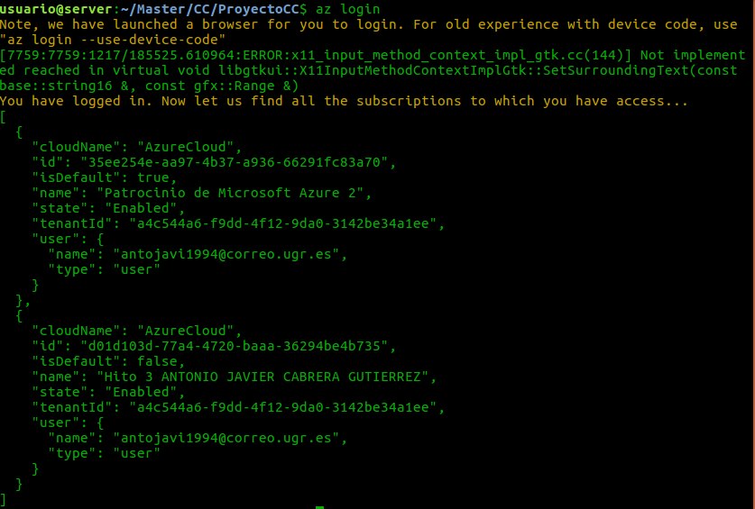
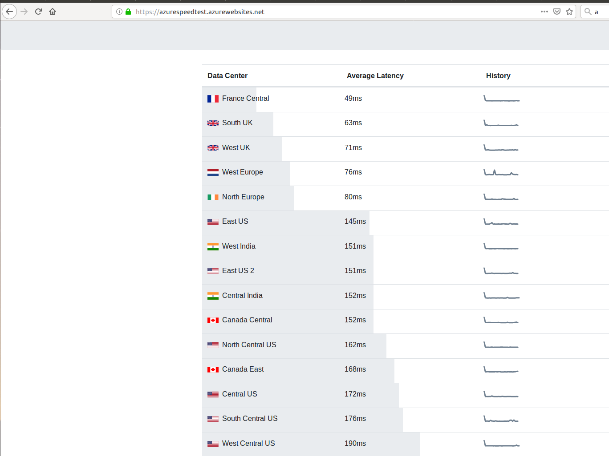
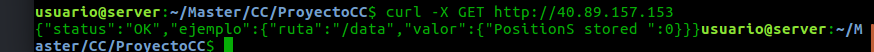

# Documentacion del Hito 4

En este hito se ha desarrollado el acopio de máquinas virtuales usando la herramienta de Azure CLI.

Además se ha instalado la base de datos MongoDB para el almacenamiento de los datos. Acontinuación se procede a explicar todo esto en detalle.

## Instalación MongoDB

La instalación de MongoDB se realiza en el archivo de playbook.yml. La parte que nos interesa de este archivo es:

```

- name: Añadir clave GPG para Mongo
  become: true
  become_method: sudo
  apt_key:
    keyserver: hkp://keyserver.ubuntu.com:80
    id: 9DA31620334BD75D9DCB49F368818C72E52529D4
    state: present
- name: Añadir repo de mongo
  become: true
  become_method: sudo
  lineinfile:
    line: "deb [ arch=amd64 ] https://repo.mongodb.org/apt/ubuntu bionic/mongodb-org/4.0 multiverse"
    dest: /etc/apt/sources.list.d/mongodb-org-4.0.list
    state: present
    create: yes

- name: Instalar MongoDB
  become: true
  become_method: sudo
  apt:
    name: mongodb-org
    state: present
    update_cache: yes

- name: Arrancar servicio
  become: true
  become_method: sudo
  service:
    name: mongod
    state: started


```

Paso por paso, tenemos que primero añadir la clave GPG para Mongo, añadimos el repositorio de Mongo, instalamos Mongo y por último arrancamos el servicio.

En la parte código de nuestra aplicación, necesitamos crear la base de datos con:


```
var MongoClient = require('mongodb').MongoClient;
var url = "mongodb://localhost:27017/mydb";

MongoClient.connect(url,{ useNewUrlParser: true }, function(err, db) {
  if (err) throw err;
  var dbo = db.db("mydb");
  dbo.createCollection("app", function(err, res) {
    if (err) throw err;
    console.log("Collection created!");
    db.close();
  });
});

```
En cada verbo de la API REST ejecutamos los comandos de la base de datos mongo correspondiente.

## Azure CLI


Para instalar la herramienta de Azure CLI tenemos que realizar los siguientes pasos:

* Modificamos la lista de origen:

```
sudo apt-get install apt-transport-https lsb-release software-properties-common -y
AZ_REPO=$(lsb_release -cs)
echo "deb [arch=amd64] https://packages.microsoft.com/repos/azure-cli/ $AZ_REPO main" | \
    sudo tee /etc/apt/sources.list.d/azure-cli.list

```

* Obtenemos la clave de firma de Microsoft:

```
sudo apt-key --keyring /etc/apt/trusted.gpg.d/Microsoft.gpg adv \
     --keyserver packages.microsoft.com \
     --recv-keys BC528686B50D79E339D3721CEB3E94ADBE1229CF
```

* Instalamos CLI de Azure:

```
sudo apt-get update
sudo apt-get install azure-cli

```

## Login

Lo primero que vamos a hacer es registrarnos con Azure CLI, con el comando az login.



## Creacion del script de Acopio

En el script, lo primero que tenemos que hacer es crear el grupo de recursos con la siguiente orden:

```
az group create --name Prueba --location francecentral

```
En este caso hemos elegido el centro de datos que tiene azure en el centro de Francia porque en el siguiente [portal web](https://azurespeedtest.azurewebsites.net/), es la que menos latencia obtenemos. En este caso, se ha elegido latencia como el parametro a medir ya que considero que es importante para tener una conexión rápida con la máquina virtual localizada en ese centro de datos.



Acontinuación creamos la red de nuestra máquina virtual y abrimos los puertos 22 y 80.

```
az network nsg create --resource-group Prueba --location francecentral --name myNet
az network nsg rule create --resource-group Prueba --nsg-name myNet --name http --protocol tcp --priority 1000 --destination-port-range 80 --access allow
az network nsg rule create --resource-group Prueba --nsg-name myNet --name ssh --protocol tcp --priority 999 --destination-port-range 22 --access allow

```

Seguidamente, creamos nuestra máquina virtual con la siguiente orden:

```
az vm create --resource-group Prueba --name CCproyecto --image Canonical:UbuntuServer:18.04-LTS:latest --admin-username antonio --generate-ssh-keys --public-ip-address-allocation static --nsg myNet

```
Con esta orden creamos una máquina virtual en el grupo de recursos creado anteriormente. Esta máquina virtual es un UbuntuServer, la version 18.04 LTS.

Esta imagen se ha elegido porque es la última version de UbuntuServer y es LTS, así nos proporciona soporte para mucho tiempo y trae paquetes instalados que en otras versiones mas antiguas no trae. Como por ejemplo NodeJS. Se ha elegido la version de UbuntuServer porque trae muchos paquetes sobre gestion web que la versión desktop no trae, como Apache.

Además, se ha realizado varias medidas usando un programa que simula un [benchmark](./../fact.java) para comprobar el rendimiento de cada sistema operativo. Este programa realiza la factorizacion de varios numeros. El programa realiza los calculos 100 veces. La salida es la media del tiempo de ejecucion y la varianza de estos datos para saber lo significativa que puede ser.

Las maquinas que se han elegido para testearlas son:


* Debian 10: con la imagen credativ:Debian:10-DAILY:latest. El resultado obtenido es:
  * Tiempo final: 48.06 ms
  * Varianza: 13.04 ms
* Ubuntu 18.04: con la imagen: Canonical:UbuntuServer:18.04-LTS:latest. El resultado obtenido es:
  * Tiempo final: 51.3636 ms
  * Varianza: 5.87 ms
* Centos 7: con la imagen: OpenLogic:CentOS-HPC:7.4:7.4.20180301. El resultado obtenido es:
  * Tiempo final: 62.3737 ms
  * Varianza: 6.35 ms

A pesar que Debian ha ejecutado el programa más rapido que Ubuntu de media, la imagen elegida es Ubuntu ya que la varianza es muy pequeña, lo que quiere decir que la media obtenida es más representativa que la de Debian. Es decir, Debian puede ejecutar el programa mucho más lento que Ubuntu en ocasiones.


Despues de la ejecucion de nuestro script, si realizamos el provisionamiento con Ansible del Hito anterior con este comando:
```
ansible-playbook ./playbook.yml -i 40.89.157.153,

```
Si hacemos una peticion GET a la ruta por defecto obtenemos la siguiente salida:


